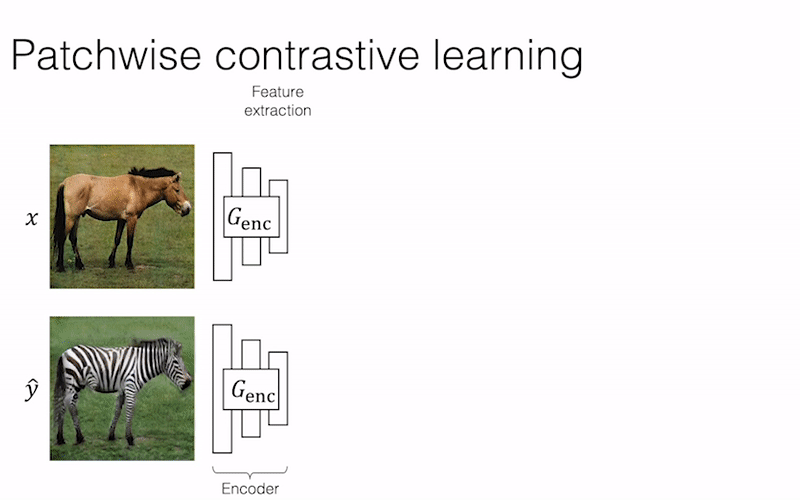
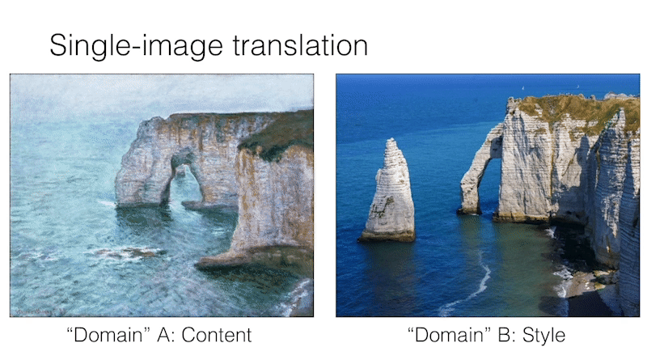
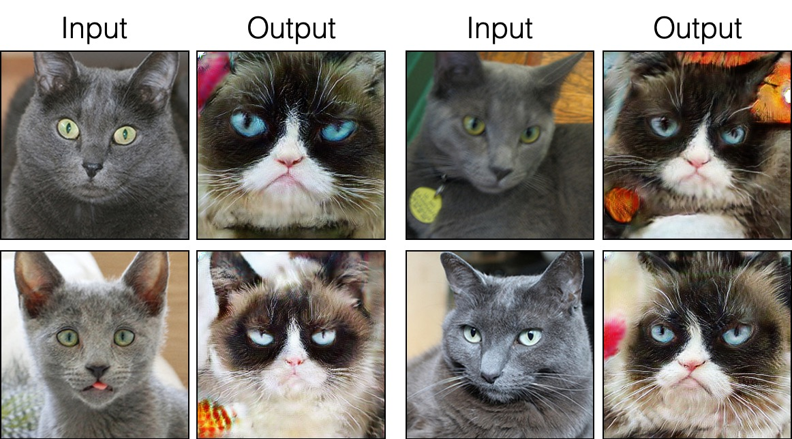
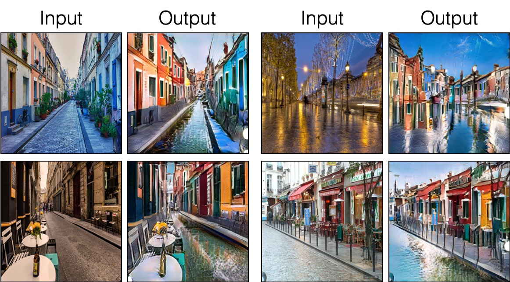
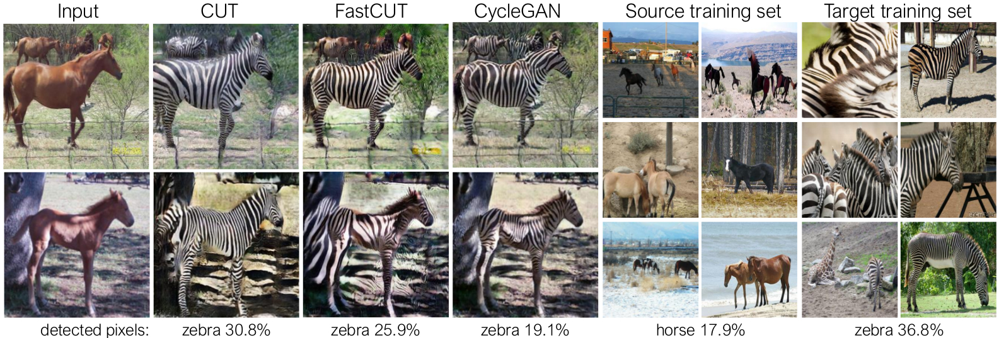

# Contrastive Unpaired Translation (CUT)

### [video (1m)](https://youtu.be/Llg0vE_MVgk) |  [video (10m)](https://youtu.be/jSGOzjmN8q0) | [website](http://taesung.me/ContrastiveUnpairedTranslation/) |   [paper](https://arxiv.org/pdf/2007.15651)
<br>


<br><br><br>


We provide our PyTorch implementation of unpaired image-to-image translation based on patchwise contrastive learning and adversarial learning.  No hand-crafted loss and inverse network is used. Compared to [CycleGAN](https://github.com/junyanz/CycleGAN), our model training is faster and less memory-intensive. In addition, our method can be extended to single image training, where each “domain” is only a *single* image.


[Contrastive Learning for Unpaired Image-to-Image Translation](http://taesung.me/ContrastiveUnpairedTranslation/)  
 [Taesung Park](https://taesung.me/), [Alexei A. Efros](https://people.eecs.berkeley.edu/~efros/), [Richard Zhang](https://richzhang.github.io/), [Jun-Yan Zhu](https://www.cs.cmu.edu/~junyanz/)<br>
UC Berkeley and Adobe Research<br>
 In ECCV 2020




<br><br><br>

### Pseudo code
```python
import torch
cross_entropy_loss = torch.nn.CrossEntropyLoss()

# Input: f_q (BxCxS) and sampled features from H(G_enc(x))
# Input: f_k (BxCxS) are sampled features from H(G_enc(G(x))
# Input: tau is the temperature used in PatchNCE loss.
# Output: PatchNCE loss
def PatchNCELoss(f_q, f_k, tau=0.07):
    # batch size, channel size, and number of sample locations
    B, C, S = f_q.shape

    # calculate v * v+: BxSx1
    l_pos = (f_k * f_q).sum(dim=1)[:, :, None]

    # calculate v * v-: BxSxS
    l_neg = torch.bmm(f_q.transpose(1, 2), f_k)

    # The diagonal entries are not negatives. Remove them.
    identity_matrix = torch.eye(S)[None, :, :]
    l_neg.masked_fill_(identity_matrix, -float('inf'))

    # calculate logits: (B)x(S)x(S+1)
    logits = torch.cat((l_pos, l_neg), dim=2) / tau

    # return PatchNCE loss
    predictions = logits.flatten(0, 1)
    targets = torch.zeros(B * S, dtype=torch.long)
    return cross_entropy_loss(predictions, targets)
```
## Example Results

### Unpaired Image-to-Image Translation


### Single Image Unpaired Translation



### Russian Blue Cat to Grumpy Cat


### Parisian Street to Burano's painted houses



## Prerequisites
- Linux or macOS
- Python 3
- CPU or NVIDIA GPU + CUDA CuDNN

### Update log

9/12/2020: Added single-image translation.

### Getting started

- Clone this repo:
```bash
git clone https://github.com/taesungp/contrastive-unpaired-translation CUT
cd CUT
```

- Install PyTorch 1.1 and other dependencies (e.g., torchvision, visdom, dominate, gputil).

  For pip users, please type the command `pip install -r requirements.txt`.

  For Conda users,  you can create a new Conda environment using `conda env create -f environment.yml`.


### CUT and FastCUT Training and Test

- Download the `grumpifycat` dataset (Fig 8 of the paper. Russian Blue -> Grumpy Cats)
```bash
bash ./datasets/download_cut_dataset.sh grumpifycat
```
The dataset is downloaded and unzipped at `./datasets/grumpifycat/`.

- To view training results and loss plots, run `python -m visdom.server` and click the URL http://localhost:8097.

- Train the CUT model:
```bash
python train.py --dataroot ./datasets/grumpifycat --name grumpycat_CUT --CUT_mode CUT
```
 Or train the FastCUT model
 ```bash
python train.py --dataroot ./datasets/grumpifycat --name grumpycat_FastCUT --CUT_mode FastCUT
```
The checkpoints will be stored at `./checkpoints/grumpycat_*/web`.

- Test the CUT model:
```bash
python test.py --dataroot ./datasets/grumpifycat --name grumpycat_CUT --CUT_mode CUT --phase train
```

The test results will be saved to a html file here: `./results/grumpifycat/latest_train/index.html`.

### CUT, FastCUT, and CycleGAN
<br>

CUT is trained with the identity preservation loss and with `lambda_NCE=1`, while FastCUT is trained without the identity loss but with higher `lambda_NCE=10.0`. Compared to CycleGAN, CUT learns to perform more powerful distribution matching, while FastCUT is designed as a lighter (half the GPU memory, can fit a larger image), and faster (twice faster to train) alternative to CycleGAN. Please refer to the [paper](https://arxiv.org/abs/2007.15651) for more details.

In the above figure, we measure the percentage of pixels belonging to the horse/zebra bodies, using a pre-trained semantic segmentation model. We find a distribution mismatch between sizes of horses and zebras images -- zebras usually appear larger (36.8\% vs. 17.9\%). Our full method CUT has the flexibility to enlarge the horses, as a means of better matching of the training statistics than CycleGAN. FastCUT behaves more conservatively like CycleGAN.

### Training using our launcher scripts

Please see `experiments/grumpifycat_launcher.py` that generates the above command line arguments. The launcher scripts are useful for configuring rather complicated command-line arguments of training and testing.

Using the launcher, the command below generates the training command of CUT and FastCUT.
```bash
python -m experiments grumpifycat train 0   # CUT
python -m experiments grumpifycat train 1   # FastCUT
```

To test using the launcher,
```bash
python -m experiments grumpifycat test 0   # CUT
python -m experiments grumpifycat test 1   # FastCUT
```

Possible commands are run, run_test, launch, close, and so on. Please see `experiments/__main__.py` for all commands. Launcher is easy and quick to define and use. For example, the grumpifycat launcher is defined in a few lines:
```python
from .tmux_launcher import Options, TmuxLauncher


class Launcher(TmuxLauncher):
    def common_options(self):
        return [
            Options(    # Command 0
                dataroot="./datasets/grumpifycat",
                name="grumpifycat_CUT",
                CUT_mode="CUT"
            ),

            Options(    # Command 1
                dataroot="./datasets/grumpifycat",
                name="grumpifycat_FastCUT",
                CUT_mode="FastCUT",
            )
        ]

    def commands(self):
        return ["python train.py " + str(opt) for opt in self.common_options()]

    def test_commands(self):
        # Russian Blue -> Grumpy Cats dataset does not have test split.
        # Therefore, let's set the test split to be the "train" set.
        return ["python test.py " + str(opt.set(phase='train')) for opt in self.common_options()]

```


### Apply a pre-trained CUT model and evaluate FID

To run the pretrained models, run the following.

```bash

# Download and unzip the pretrained models. The weights should be located at
# checkpoints/horse2zebra_cut_pretrained/latest_net_G.pth, for example.
wget http://efrosgans.eecs.berkeley.edu/CUT/pretrained_models.tar
tar -xf pretrained_models.tar

# Generate outputs. The dataset paths might need to be adjusted.
# To do this, modify the lines of experiments/pretrained_launcher.py
# [id] corresponds to the respective commands defined in pretrained_launcher.py
# 0 - CUT on Cityscapes
# 1 - FastCUT on Cityscapes
# 2 - CUT on Horse2Zebra
# 3 - FastCUT on Horse2Zebra
# 4 - CUT on Cat2Dog
# 5 - FastCUT on Cat2Dog
python -m experiments pretrained run_test [id]

# Evaluate FID. To do this, first install pytorch-fid of https://github.com/mseitzer/pytorch-fid
# pip install pytorch-fid
# For example, to evaluate horse2zebra FID of CUT,
# python -m pytorch_fid ./datasets/horse2zebra/testB/ results/horse2zebra_cut_pretrained/test_latest/images/fake_B/
# To evaluate Cityscapes FID of FastCUT,
# python -m pytorch_fid ./datasets/cityscapes/valA/ ~/projects/contrastive-unpaired-translation/results/cityscapes_fastcut_pretrained/test_latest/images/fake_B/
# Note that a special dataset needs to be used for the Cityscapes model. Please read below. 
python -m pytorch_fid [path to real test images] [path to generated images]

```

Note: the Cityscapes pretrained model was trained and evaluated on a resized and JPEG-compressed version of the original Cityscapes dataset. To perform evaluation, please download [this](http://efrosgans.eecs.berkeley.edu/CUT/datasets/cityscapes_val_for_CUT.tar) validation set and perform evaluation. 


### SinCUT Single Image Unpaired Training

To train SinCUT (single-image translation, shown in Fig 9, 13 and 14 of the paper), you need to

1. set the `--model` option as `--model sincut`, which invokes the configuration and codes at `./models/sincut_model.py`, and
2. specify the dataset directory of one image in each domain, such as the example dataset included in this repo at `./datasets/single_image_monet_etretat/`. 

For example, to train a model for the [Etretat cliff (first image of Figure 13)](https://github.com/taesungp/contrastive-unpaired-translation/blob/master/imgs/singleimage.gif), please use the following command.

```bash
python train.py --model sincut --name singleimage_monet_etretat --dataroot ./datasets/single_image_monet_etretat
```

or by using the experiment launcher script,
```bash
python -m experiments singleimage run 0
```

For single-image translation, we adopt network architectural components of [StyleGAN2](https://github.com/NVlabs/stylegan2), as well as the pixel identity preservation loss used in [DTN](https://arxiv.org/abs/1611.02200) and [CycleGAN](https://github.com/junyanz/pytorch-CycleGAN-and-pix2pix/blob/master/models/cycle_gan_model.py#L160). In particular, we adopted the code of [rosinality](https://github.com/rosinality/stylegan2-pytorch), which exists at `models/stylegan_networks.py`.

The training takes several hours. To generate the final image using the checkpoint,

```bash
python test.py --model sincut --name singleimage_monet_etretat --dataroot ./datasets/single_image_monet_etretat
```

or simply

```bash
python -m experiments singleimage run_test 0
```

### [Datasets](./docs/datasets.md)
Download CUT/CycleGAN/pix2pix datasets. For example,

```bash
bash datasets/download_cut_datasets.sh horse2zebra
```

The Cat2Dog dataset is prepared from the AFHQ dataset. Please visit https://github.com/clovaai/stargan-v2 and download the AFHQ dataset by `bash download.sh afhq-dataset` of the github repo. Then reorganize directories as follows.
```bash
mkdir datasets/cat2dog
ln -s datasets/cat2dog/trainA [path_to_afhq]/train/cat
ln -s datasets/cat2dog/trainB [path_to_afhq]/train/dog
ln -s datasets/cat2dog/testA [path_to_afhq]/test/cat
ln -s datasets/cat2dog/testB [path_to_afhq]/test/dog
```

The Cityscapes dataset can be downloaded from https://cityscapes-dataset.com.
After that, use the script `./datasets/prepare_cityscapes_dataset.py` to prepare the dataset. 


#### Preprocessing of input images

The preprocessing of the input images, such as resizing or random cropping, is controlled by the option `--preprocess`, `--load_size`, and `--crop_size`. The usage follows the [CycleGAN/pix2pix](https://github.com/junyanz/pytorch-CycleGAN-and-pix2pix) repo. 

For example, the default setting `--preprocess resize_and_crop --load_size 286 --crop_size 256` resizes the input image to `286x286`, and then makes a random crop of size `256x256` as a way to perform data augmentation. There are other preprocessing options that can be specified, and they are specified in [base_dataset.py](https://github.com/taesungp/contrastive-unpaired-translation/blob/master/data/base_dataset.py#L82). Below are some example options. 

 - `--preprocess none`: does not perform any preprocessing. Note that the image size is still scaled to be a closest multiple of 4, because the convolutional generator cannot maintain the same image size otherwise. 
 - `--preprocess scale_width --load_size 768`: scales the width of the image to be of size 768.
 - `--preprocess scale_shortside_and_crop`: scales the image preserving aspect ratio so that the short side is `load_size`, and then performs random cropping of window size `crop_size`.

More preprocessing options can be added by modifying [`get_transform()`](https://github.com/taesungp/contrastive-unpaired-translation/blob/master/data/base_dataset.py#L82) of `base_dataset.py`. 


### Citation
If you use this code for your research, please cite our [paper](https://arxiv.org/pdf/2007.15651).
```
@inproceedings{park2020cut,
  title={Contrastive Learning for Unpaired Image-to-Image Translation},
  author={Taesung Park and Alexei A. Efros and Richard Zhang and Jun-Yan Zhu},
  booktitle={European Conference on Computer Vision},
  year={2020}
}
```

If you use the original [pix2pix](https://phillipi.github.io/pix2pix/) and [CycleGAN](https://junyanz.github.io/CycleGAN/) model included in this repo, please cite the following papers
```
@inproceedings{CycleGAN2017,
  title={Unpaired Image-to-Image Translation using Cycle-Consistent Adversarial Networks},
  author={Zhu, Jun-Yan and Park, Taesung and Isola, Phillip and Efros, Alexei A},
  booktitle={IEEE International Conference on Computer Vision (ICCV)},
  year={2017}
}


@inproceedings{isola2017image,
  title={Image-to-Image Translation with Conditional Adversarial Networks},
  author={Isola, Phillip and Zhu, Jun-Yan and Zhou, Tinghui and Efros, Alexei A},
  booktitle={IEEE Conference on Computer Vision and Pattern Recognition (CVPR)},
  year={2017}
}
```


### Acknowledgments
We thank Allan Jabri and Phillip Isola for helpful discussion and feedback. Our code is developed based on [pytorch-CycleGAN-and-pix2pix](https://github.com/junyanz/pytorch-CycleGAN-and-pix2pix). We also thank [pytorch-fid](https://github.com/mseitzer/pytorch-fid) for FID computation,  [drn](https://github.com/fyu/drn) for mIoU computation, and [stylegan2-pytorch](https://github.com/rosinality/stylegan2-pytorch/) for the PyTorch implementation of StyleGAN2 used in our single-image translation setting.
